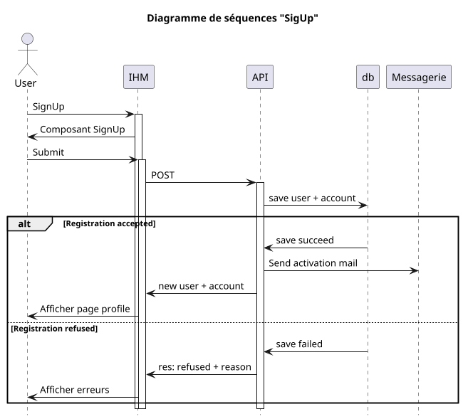
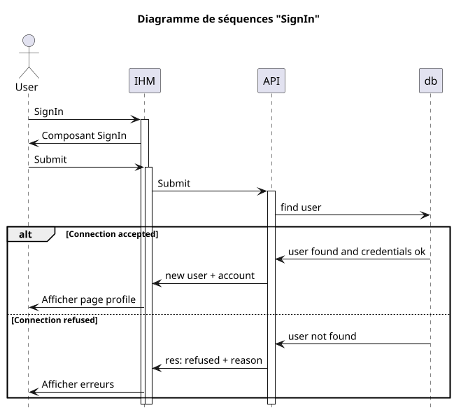

## Comptes

- [ ] SignUp
- [ ] SignIn
- [ ] SignOut
- [ ] Statut

### Processus

#### SignUp

Un utilisateur non identifié peut créer un compte. Selon le contexte, l'application propose à l'utilisateur de choisir sa [casquette](../objects/dictionnaire.md)

Lorsque l'utilisateur se déconnecte, l'ensemble des opérations enregistrées sur le poste client sont effacées.

#### SignIn

L'utilisateur saisit les données d'identification. L'identifiant de connexion est soit :
- [nom d'utilisateur](../objects/dictionnaire.md#username)
- email
- numéro de téléphone (à réaliser)
- via délégation d'identification ([oAuth](../objects/dictionnaire.md#oauth))

Lorsque que l'utilisateur se connecte, les éléments de connexion sont transmis à l'API.

#### SignOut

La déconnexion d'un utilisateur provoque la suppression des éléments d'identification de l'utilisateur dans l'interface.

### Status

