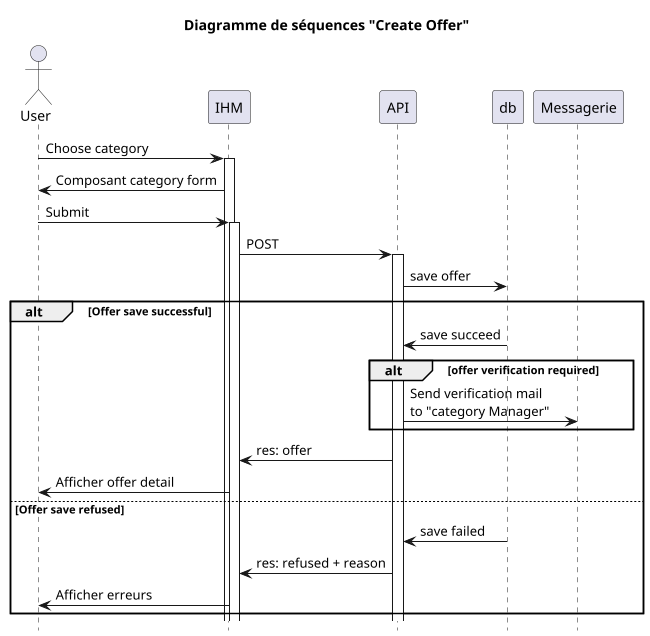

## Gestion des offres

- [ ] Create offer
- [ ] Modify offer
- [ ] Change offer
- [ ] status

- L'utilisateur disposant du droit adhoc (supplier) sélectionne une catégorie.
- Le formulaire de catégories est affiché.
- L'utilisateur renseigne les informations nécessaires
- L'utilisateur soumet le formulaire
  - Si les vérifications coté client sont invalides, un message d'erreur dans la langue de l'interface est affiché
  - Si les vérification coté client sont valides, le formulaire est adressé à l'API correspondante
    - L'API vérifie les paramètres d'identification (token)
    - Si le token est invalide un message d'erreur est retourné au poste client
    - Si le token est valide
      - la charge utile (payload) est traduite sous forme d'offre
      - l'offre prend le statut [`pending`](#status)

### Processus

#### Create Offer

L'utilisateur choisit une catégorie, le formulaire adhoc est affiché. Il renseigne les champs requis, puis soumet le formulaire à l'API.
**RQE**: Procédure de validation de l'offre

#### Modify Offer

### Status

