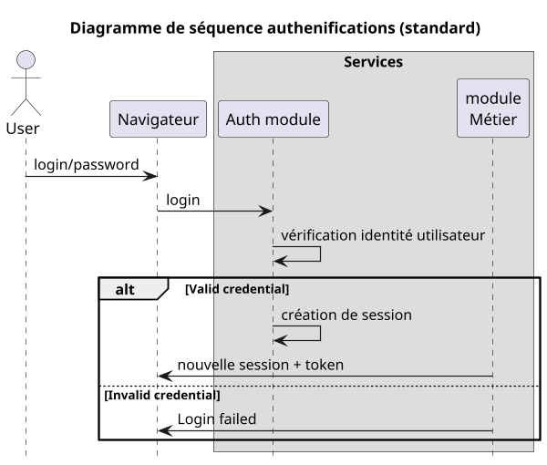
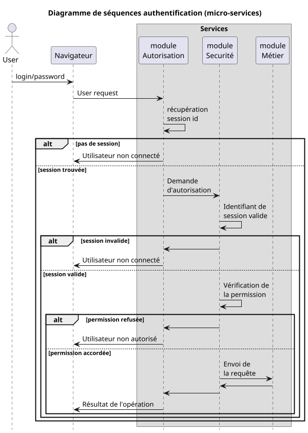

# Authentification

## Version standard

```plantuml
@startuml
scale 600 width
title Diagramme de séquence authenifications (standard)
hide footbox
actor User

User -> "Navigateur": login/password
"Navigateur" -> "Auth module": login
"Auth module" -> "Auth module": vérification identité utilisateur
alt Valid credential
"Auth module" -> "Auth module": création de session
"module\nMétier" -> "Navigateur": nouvelle session + token
else Invalid credential
"module\nMétier" -> "Navigateur": Login failed
end
box "Services"
  participant "Auth module"
  participant "module\nMétier"
end box
@enduml
```

## Version micro-services

```plantuml
@startuml
scale 600 width
title Diagramme de séquences authentification (micro-services)
hide footbox
actor User

User -> "Navigateur": login/password
"Navigateur" -> "module\nAutorisation": User request
"module\nAutorisation" -> "module\nAutorisation": récupération\nsession id
alt pas de session
"module\nAutorisation" -> "Navigateur": Utilisateur non connecté
else session trouvée
  "module\nAutorisation" -> "module\nSecurité": Demande\nd'autorisation
  "module\nSecurité" -> "module\nSecurité": Identifiant de\nsession valide
  alt session invalide
    "module\nSecurité" -> "module\nAutorisation"
    "module\nAutorisation" -> Navigateur: Utilisateur non connecté
  else session valide
    "module\nSecurité" -> "module\nSecurité": Vérification de\nla permission
    alt permission refusée
      "module\nSecurité" -> "module\nAutorisation"
      "module\nAutorisation" -> Navigateur: Utilisateur non autorisé
    else permission accordée
      "module\nSecurité" -> "module\nMétier": Envoi de\nla requête
      "module\nMétier" -> "module\nSecurité"
      "module\nSecurité" -> "module\nAutorisation"
      "module\nAutorisation" -> Navigateur: Résultat de l'opération
    end
  end
end

box "Services"
  participant "module\nAutorisation"
  participant "module\nSecurité"
  participant "module\nMétier"
end box
@enduml
```
