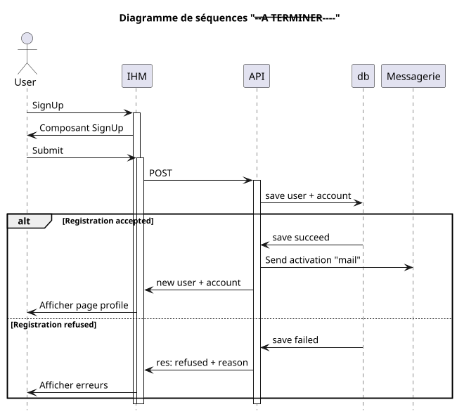

## Order

- [] Create order
- [] Modify order
- [] Delete order
- [] Statuts order

### Processus

> **Hypothèse de travail:**
> - l'utilisateur est identifié dans le système
> - l'utilisateur dispose du rôle `customer`
> - le système a déterminé quelle est l'offre qui sera attribuée au client

#### Create order

- Le formulaire adapté s'affiche dans le navigateur
- L'utilisateur renseigne les informations nécessaires pour que le formulaire soit valide.
- En cas d'invalidité du formulaire un message est affiché dans la langue correspondant aux paramètres configurés.
- En cas de validité l'application soumet la chage utile (payload) à l'API
- L'API controle l'intégrité des informations
- Si les données ne satisfont pas les contrôles l'API retourne le code erreur associé.
- Le statut de l'ordre est `pending`
- Sinon les données sont enregistrée dans la base de données
- Si la validation requière une action externe, un message est alors adressé à la queue de traitement asynchrone.
- Si la validation est automatique le statut de l'ordre est alors `accepted`
- Un message est adressé de façon asynchrone (queue de traitement) aux destinataires selon leurs configurations
- Un message est retourné par l'API informant le poste client du résultat de l'opération de création

#### Modify order

Certaines informations peuvent être modifiées sans que l'intégrité de l'ordre n'en soit impacté. D'autres impliquent une nouvelle validation.

#### Delete order

Un ordre est effacé de façon unique, c'est son statut qui est changé `archived`, `deleted`, `canceled`

### Status

Les status de l'objet
