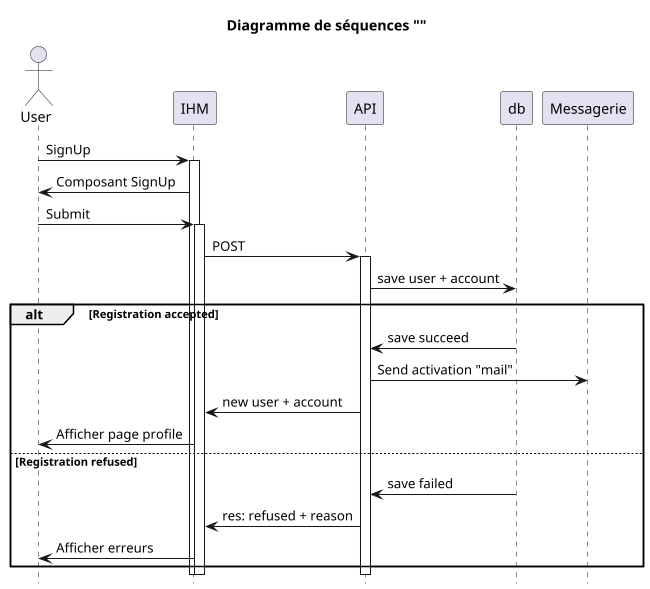

## Réglement

- [] Create réglement
- [] Modify réglement
- [] Delete réglement
- [] Statuts réglement

### Processus

#### Create réglement

#### Modify réglement

#### Delete réglement

### Status

Les status de l'objet
