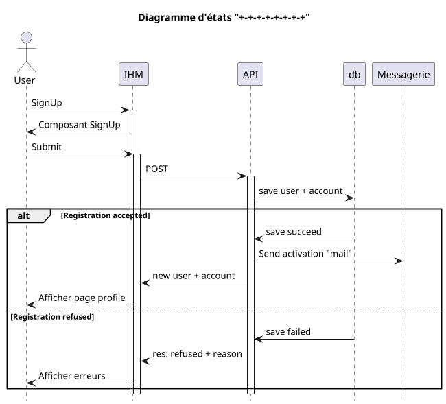

## Validation d'offre

- [] Create offer validation
- [] Modify offer validation
- [] Delete offer validation
- [] Statuts offer validation

### Processus

#### Create offer validation

#### Modify offer validation

#### Delete offer validation

### Status

Les status de l'objet
