## Validation d'ordre

- [] Create order validation
- [] Modify order validation
- [] Delete order validation
- [] Statuts order validation

### Processus

#### Create order validation

#### Modify order validation

#### Delete order validation

processus short description

```plantuml
@startuml
scale 650 width
title Diagramme d'états "=-=-=-=-=-=-=-=-=-=-="
hide footbox

actor User
User -> IHM: SignUp
Activate IHM
IHM -> User: Composant SignUp
User -> IHM: Submit
Activate IHM
IHM -> API: POST
Activate API
API -> db: save user + account
alt Registration accepted
  API <- db: save succeed
  API -> Messagerie: Send activation "mail"
  API -> IHM: new user + account
  IHM -> User: Afficher page profile
else Registration refused
  API <- db: save failed
  API -> IHM: res: refused + reason
  IHM -> User: Afficher erreurs
end
@enduml
```

### Status

Les status de l'objet
