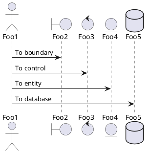

# test-generate-plantuml

```plantuml:fichier-de-test2
@startuml
actor Foo1
boundary Foo2
control Foo3
entity Foo4
database Foo5
Foo1 -> Foo2 : To boundary
Foo1 -> Foo3 : To control
Foo1 -> Foo4 : To entity
Foo1 -> Foo5 : To database
@enduml
```

test
